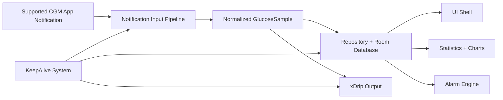
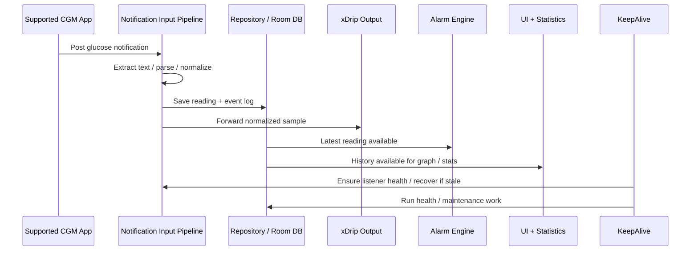

# BridgeCGM Architecture Guide

## Purpose

BridgeCGM is an Android bridge application that:

1. listens to glucose-related notifications from supported CGM companion apps,
2. parses those notifications into a normalized internal glucose model,
3. stores readings and event logs locally,
4. forwards glucose data to xDrip+ using the broadcast path already used by this project,
5. evaluates alarm conditions,
6. renders graphs and statistics for the user, and
7. keeps the whole pipeline alive in the background even when Android becomes aggressive about background execution.

This document explains the architecture of the **clean refactor project** and the functional purpose of each block in a way that is friendly to a new developer joining the project.

---

# 1. Big Picture

## 1.1 One-sentence summary

BridgeCGM is a **background Android data bridge** that converts supported CGM app notifications into structured glucose data, stores that data locally, shows it in the UI, raises alarms, and relays it to xDrip+.

## 1.2 Main runtime pipeline



## 1.3 Simple mental model

Think of the software as five cooperating machines:

- **Machine 1: KeepAlive**  
  Keeps the app alive and checks that background processing still works.
- **Machine 2: Input**  
  Reads incoming notifications and turns them into clean data.
- **Machine 3: Storage**  
  Saves readings and logs in a database.
- **Machine 4: Consumers**  
  Uses stored data for graphing, alarms, and broadcasting.
- **Machine 5: UI**  
  Lets the user see data and configure behavior.

---

# 2. Refactored Package Layout

```text
tw.yourcompany.cgmbridge
├─ core
│  ├─ model
│  ├─ data
│  ├─ db
│  ├─ prefs
│  ├─ config
│  ├─ logging
│  ├─ constants
│  └─ platform
│
├─ feature
│  ├─ keepalive
│  ├─ input
│  │  └─ notification
│  ├─ output
│  │  └─ xdrip
│  ├─ alarm
│  ├─ statistics
│  ├─ calibration
│  └─ ui
│     └─ shell
│
└─ future
   ├─ nightscout
   │  ├─ input
   │  └─ output
   └─ iobcob
```

## 2.1 Why this layout exists

The layout is intentionally split by **responsibility** rather than by old folder history.

- `core/*` contains shared building blocks.
- `feature/*` contains real runtime features.
- `future/*` contains reserved placeholders for planned work that is not implemented yet.

This helps a multi-programmer team because each group can own a clear functional area.

---

# 3. Data Flow: End-to-End

## 3.1 Sequence diagram



## 3.2 Step-by-step explanation

### Step 1 - A supported CGM app posts a notification
A supported app such as Dexcom, AiDEX, or OTTAi creates a notification containing glucose information.

### Step 2 - The notification listener receives it
The app's notification listener service detects the new notification and begins processing.

### Step 3 - Notification content is extracted
The input pipeline reads text from notification views and extras so it can access the glucose value, unit, trend, and supporting strings.

### Step 4 - Parsing converts raw text into structured data
The parser interprets the notification and creates a normalized glucose reading object.

### Step 5 - The reading is stored
The importer / repository writes the reading into the Room database. Event logs can also be stored for debugging and history.

### Step 6 - Other features consume the saved data
After storage, the reading can be used by:

- the UI shell,
- graph and statistics features,
- alarm logic, and
- the xDrip output sender.

### Step 7 - KeepAlive continues protecting the system
The keepalive system makes sure the listener, polling, and background tasks stay healthy over time.

---

# 4. Block-by-Block Architecture

# 4A. `core/*` - Shared Foundation

## Purpose
The `core` layer contains shared types and services that are used by several features.

## Sub-blocks

### `core/model`
Contains shared domain models such as the normalized glucose sample.

**Why it matters:**  
Every feature should use the same glucose representation so parsing, storage, alarms, graphs, and output all stay consistent.

### `core/data`
Contains the repository layer.

**Why it matters:**  
Other features should not directly scatter database logic everywhere. The repository provides one place to read and write data.

### `core/db`
Contains Room database classes, DAOs, and entities.

**Why it matters:**  
This is the persistent storage engine of the app.

### `core/prefs`
Contains app preference access.

**Why it matters:**  
Thresholds, settings, timestamps, and other persisted user/runtime settings belong in one shared configuration access layer.

### `core/config`
Contains build-time or feature configuration flags.

**Why it matters:**  
Centralized switches make it easier to control optional behavior.

### `core/logging`
Contains log categories and debug tracing helpers.

**Why it matters:**  
A bridge app is background-heavy. Good logs are essential when the app appears to “stop working”.

### `core/constants`
Contains shared constants such as glucose-related numeric conventions.

### `core/platform`
Contains Android-platform helper utilities such as:

- battery optimization guidance,
- notification access checks,
- bug report export support.

## New developer advice
If you are new to the project, learn `core` first. It tells you what the rest of the project considers a reading, how data is stored, and how settings are accessed.

---

# 4B. `feature/keepalive/*` - Background Survival System

## Purpose
This feature keeps the bridge alive, restarts important background paths, and protects the data pipeline from Android background restrictions.

## Typical responsibilities

- application startup initialization,
- reboot/app-update recovery,
- watchdog scheduling,
- foreground service lifecycle,
- periodic health checks,
- database maintenance work.

## Main idea
The app must survive conditions such as:

- device reboot,
- app update,
- Android delaying or killing background work,
- notification listener becoming stale or disconnected.

## Internal blocks

### Application entry point
Initial app startup can queue periodic work and arm keepalive behavior.

### Boot receiver
Restores critical scheduling after device reboot or after the app is replaced.

### Guardian restart receiver
Provides another recovery entry point for watchdog restart paths.

### Poll scheduler + poll receiver
Provides a heartbeat layer so the app can periodically check whether notification handling is still healthy.

### Foreground guardian service
Runs as an ongoing foreground service to keep the bridge more resilient in the background.

### Health worker
Periodic health verification that checks whether key timestamps or liveness conditions are stale.

### Database maintenance worker
Performs cleanup tasks such as purging old records so the database does not grow forever.

## Why this block is separate
KeepAlive is **operational infrastructure**, not glucose business logic.

A parser developer should not need to modify boot recovery code.
A UI developer should not need to understand every background watchdog layer.

## Beginner analogy
This block is the project's **life support system**.
If it fails, the rest of the system may be correct but still stop receiving data.

---

# 4C. `feature/input/notification/*` - Notification Input Pipeline

## Purpose
This is the main production input pipeline today.
It receives external notification data and turns it into structured internal glucose readings.

## Responsibilities

- listen for notifications,
- identify supported source packages,
- extract text from notification content,
- parse glucose value / unit / trend / time,
- normalize the result,
- import the result into storage.

## Important concept: this is a pipeline, not one class

```text
NotificationListenerService
→ text extraction
→ package filtering
→ parser
→ time/trend handling
→ importer
→ repository/database
```

## Internal blocks

### Notification listener service
This is the Android entry point that receives notification callbacks.

### Notification debug dumper
Helpful for investigating unknown notification layouts or parsing failures.

### RemoteViews text extractor
Reads text from the notification view hierarchy when useful data is not available in a simple direct field.

### Supported packages definition
Lists which notification sources the bridge should trust and parse.

### Generic CGM notification parser
Converts raw strings into glucose-related fields.

### Timestamp extractor
Determines the correct reading time when notification text includes time indicators.

### Trend and slope helpers
Maps arrow symbols or calculated slope into the trend directions used downstream.

### Importer
Takes a parsed glucose result and commits it into persistent storage using the repository.

## Why this block is critical
This is where outside-world noise becomes clean structured data.
If this block is weak, every downstream block becomes unreliable.

## Common beginner mistake
Do not split this pipeline into random unrelated folders.
The listener, parser, and importer are tightly related stages of the same input journey.

---

# 4D. `feature/output/xdrip/*` - xDrip Broadcast Output

## Purpose
This block sends normalized glucose data to xDrip+ using the broadcast style already supported by the original project.

## Responsibilities

- accept normalized glucose samples,
- convert them into the payload xDrip expects,
- send the broadcast reliably from the bridge.

## Why it is separate
Output logic is a different concern from input logic.

- Input deals with messy external notifications.
- Output deals with structured internal data and external delivery.

That separation makes it easier to add future outputs later without polluting the input pipeline.

## Beginner analogy
This block is the **courier**.
The input block decodes messages from the outside world. The output block delivers clean messages to xDrip.

---

# 4E. `feature/alarm/*` - Alarm and Reminder Engine

## Purpose
This block decides whether glucose readings should trigger alarms and manages the alarm behavior.

## Responsibilities

- define alarm rules,
- store / interpret alarm configuration,
- decide whether a new reading should trigger a sound,
- play alarm audio,
- expose a settings screen for alarm behavior.

## Main idea
The alarm engine consumes the latest glucose data and applies policy.
It should not parse notifications, and it should not own database design.
It only answers questions like:

- Is the glucose too high?
- Is the glucose too low?
- Is it time to remind again?
- Which sound should play?

## Internal blocks

### Alarm rule definitions
Encodes alarm categories such as high, low, urgent low.

### Alarm sound player
Handles sound playback.

### Reminder evaluator
Decides whether alarm conditions are currently met and whether re-alert timing allows another alert.

### Alarm settings activity
Lets the user configure alarm behavior.

## Beginner analogy
This is the **safety bell system**.
It watches numbers and decides when the user must be alerted.

---

# 4F. `feature/statistics/*` - Graphs and Analysis

## Purpose
This feature turns stored glucose history into something the user can understand visually and analytically.

## Responsibilities

- chart building,
- marker / data-point display,
- glucose variability calculations,
- summary metric calculation.

## Examples of statistics handled here

- standard deviation,
- coefficient of variation,
- estimated HbA1c / glucose management style summary,
- min/max,
- range-oriented summaries.

## Why this is its own feature
Statistics and charts are consumers of stored data.
They do not own notification handling, keepalive behavior, or xDrip broadcasting.

## Beginner analogy
This block is the **dashboard and analytics room**.
It helps the user interpret what has already been collected.

---

# 4G. `feature/calibration/*` - Calibration-related Support

## Purpose
This block contains calibration settings and calibration-related UI helpers.

## Why this is separate
Calibration is conceptually different from:

- parsing notifications,
- storing readings,
- alarm timing,
- graph drawing.

Keeping calibration isolated makes future work cleaner.

---

# 4H. `feature/ui/shell/*` - App Screens and UI Glue

## Purpose
This block contains the visible app shell and screen-level coordination.

## Responsibilities

- main screen,
- setup flow,
- disclaimer flow,
- settings shell,
- view-model glue,
- simple adapters used by screens.

## Important design rule
The UI shell should coordinate features, not re-implement them.

For example:
- the UI should request graph data, not calculate every statistic itself;
- the UI should display alarm settings, not own alarm timing policy;
- the UI should show latest glucose, not become the source of truth for stored data.

## Beginner analogy
This is the **front desk** of the application.
It presents the system to the user and routes the user to the right controls.

---

# 4I. `future/*` - Reserved Expansion Areas

## Purpose
These packages are explicit placeholders for future features that are not implemented yet.

## Current future areas

### `future/nightscout/input`
Reserved for a future Nightscout ingestion path.

### `future/nightscout/output`
Reserved for a future Nightscout upload path.

### `future/iobcob`
Reserved for future insulin-on-board / carbs-on-board work.

## Why placeholders matter
Without official future locations, unfinished experiments often get scattered into random packages.
That causes architecture drift and makes the codebase harder to understand.

---

# 5. Ownership Model for a Team

For a multi-programmer project, a practical ownership split can look like this:

- **Platform / infrastructure developer**
  - `feature/keepalive/*`
  - `core/platform/*`
  - `core/logging/*`

- **Input pipeline developer**
  - `feature/input/notification/*`

- **Storage / data developer**
  - `core/model/*`
  - `core/data/*`
  - `core/db/*`
  - `core/prefs/*`

- **Output / integration developer**
  - `feature/output/xdrip/*`
  - later `future/nightscout/output/*`

- **UI / analytics developer**
  - `feature/ui/shell/*`
  - `feature/statistics/*`
  - `feature/calibration/*`

- **Product / future feature developer**
  - `future/nightscout/*`
  - `future/iobcob/*`

This reduces merge conflicts because people stop editing the same oversized files for unrelated reasons.

---

# 6. Recommended Reading Order for a New Developer

If you are completely new to the codebase, read in this order:

1. `Documentation/Clean_Refactor_Architecture.md`
2. `core/model/*`
3. `core/data/*` and `core/db/*`
4. `core/prefs/*` and `core/config/*`
5. `feature/input/notification/*`
6. `feature/output/xdrip/*`
7. `feature/keepalive/*`
8. `feature/alarm/*`
9. `feature/statistics/*`
10. `feature/ui/shell/*`
11. `future/*`

This reading order follows the natural logic of the app:

- understand the shared data model,
- understand how data gets in,
- understand how data gets stored,
- understand what consumes that data,
- finally understand the shell and future extensions.

---

# 7. What Is Implemented Now vs. Future Work

## Implemented now

- keepalive infrastructure,
- notification input pipeline,
- local storage and logs,
- xDrip output,
- alarm system,
- graphs and statistics,
- UI shell,
- calibration-related support pieces.

## Reserved for future work

- Nightscout input,
- Nightscout output,
- IOB/COB logic.

---

# 8. Common Debugging Entry Points

## If the bridge stops receiving readings
Start in:

- `feature/keepalive/*`
- `feature/input/notification/*`
- `core/platform/NotificationAccessChecker`

## If the graph is empty but readings should exist
Start in:

- `core/data/*`
- `core/db/*`
- `feature/statistics/*`
- `feature/ui/shell/*`

## If xDrip is not receiving values
Start in:

- `feature/output/xdrip/*`
- input pipeline path that creates normalized samples

## If alarms are not firing correctly
Start in:

- `feature/alarm/*`
- `core/prefs/*`
- latest-reading access in repository / DB

---

# 9. Key Architecture Rules

To keep the project clean, new contributors should follow these rules:

1. **Do not bypass `core` for shared data.**  
   Shared models, persistence, prefs, and common helpers should stay centralized.

2. **Do not put future work into production packages.**  
   Unfinished Nightscout or IOB/COB code belongs in `future/*` until it becomes real.

3. **Do not turn UI into business logic.**  
   Screens should coordinate features, not become the source of truth.

4. **Do not mix keepalive and business logic without a good reason.**  
   Background survival code should stay distinct from glucose domain behavior.

5. **Keep the notification pipeline cohesive.**  
   Listener, extraction, parsing, timestamp handling, and import are one journey.

6. **Keep output adapters isolated.**  
   xDrip logic should stay inside its output feature so future outputs can be added cleanly.

---

# 10. Final Summary

BridgeCGM is best understood as a structured flow:

1. **KeepAlive** ensures the system stays running.
2. **Input** converts supported CGM notifications into normalized glucose data.
3. **Core storage** persists that data safely.
4. **Consumers** use the stored data for UI, statistics, alarms, and xDrip output.
5. **Future placeholders** reserve clean space for Nightscout and IOB/COB.

If a new developer understands those five ideas, they can quickly find the right block and avoid getting lost in the codebase.
